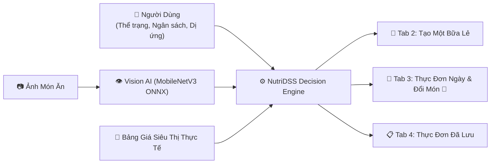
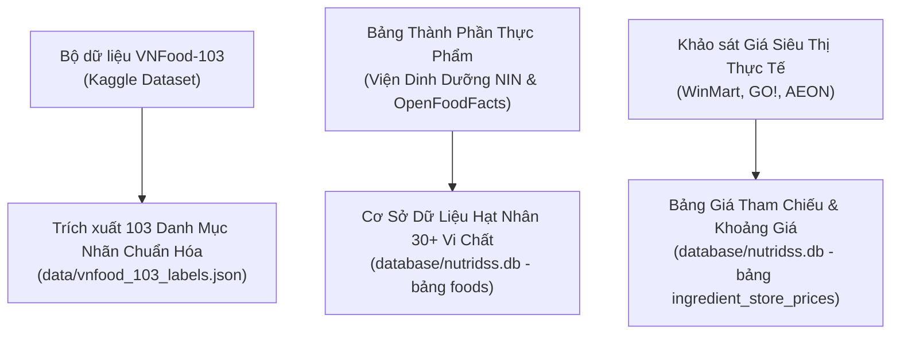
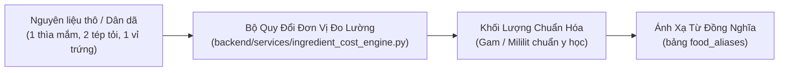
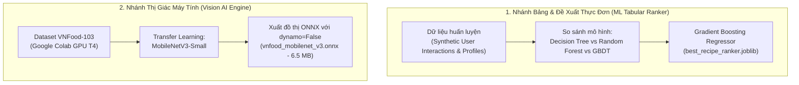
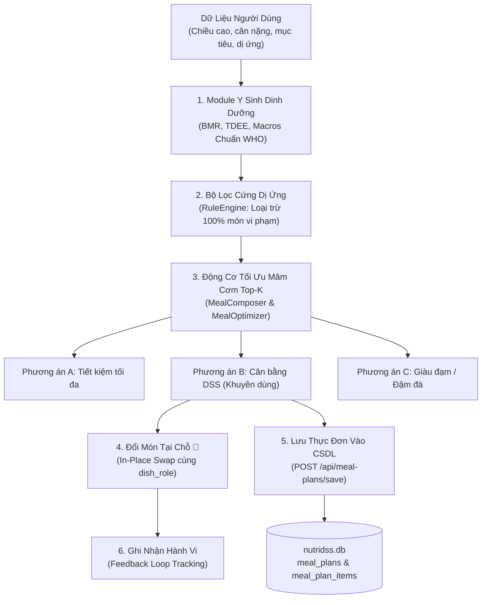

# BÁO CÁO CẤU TRÚC KỸ THUẬT TOÀN DIỆN DỰ ÁN NUTRIDSS V2
## HỆ HỖ TRỢ RA QUYẾT ĐỊNH DINH DƯỠNG & LẬP THỰC ĐƠN CHUẨN VIỆT TỰ ĐỘNG

---

## MỤC LỤC
1. [TỔNG QUAN HỆ THỐNG & NGUYÊN TẮC THIẾT KẾ](#1-tổng-quan-hệ-thống--nguyên-tắc-thiết-kế)
2. [CHI TIẾT TOÀN DIỆN CÁC GIAI ĐOẠN LÀM VIỆC TỪ ĐẦU ĐẾN CUỐI](#2-chi-tiết-toàn-diện-các-giai-đoạn-làm-việc-từ-đầu-đến-cuối)
   - [Giai đoạn 1: Thu thập & Khai thác Dataset](#giai-đoạn-1-thu-thập--khai-thác-dataset)
   - [Giai đoạn 2: Tiền xử lý & Chuẩn hóa định lượng khoa học](#giai-đoạn-2-tiền-xử-lý--chuẩn-hóa-định-lượng-khoa-học)
   - [Giai đoạn 3: Huấn luyện Mô hình Machine Learning & Vision AI](#giai-đoạn-3-huấn-luyện-mô-hình-machine-learning--vision-ai)
   - [Giai đoạn 4: Gán nhãn Món ăn, Dinh dưỡng, Giá siêu thị & Vai trò mâm cơm](#giai-đoạn-4-gán-nhãn-món-ăn-dinh-dưỡng-giá-siêu-thị--vai-trò-mâm-cơm)
   - [Giai đoạn 5: Xây dựng DSS Engine, Tối ưu ngân sách & Vòng lặp phản hồi](#giai-đoạn-5-xây-dựng-dss-engine-tối-ưu-ngân-sách--vòng-lặp-phản-hồi)
3. [CẤU TRÚC CHƯƠNG TRÌNH & PHÂN CÔNG TRÁCH NHIỆM TỪNG FILE](#3-cấu-trúc-chương-trình--phân-công-trách-nhiệm-từng-file)
4. [SƠ ĐỒ CÂY CẤU TRÚC DỰ ÁN (PROJECT DIRECTORY TREE)](#4-sơ-đồ-cây-cấu-trúc-dự-án-project-directory-tree)
5. [LUỒNG TƯƠNG TÁC DỮ LIỆU & 7 TABS GIAO DIỆN NGƯỜI DÙNG](#5-luồng-tương-tác-dữ-liệu--7-tabs-giao-diện-người-dùng)
6. [HỆ THỐNG KIỂM THỬ TỰ ĐỘNG & BẢO ĐẢM CHẤT LƯỢNG](#6-hệ-thống-kiểm-thử-tự-động--bảo-đảm-chất-lượng)

---

## 1. TỔNG QUAN HỆ THỐNG & NGUYÊN TẮC THIẾT KẾ

**NutriDSS V2 (Nutritional Decision Support System)** là một hệ thống hỗ trợ ra quyết định dinh dưỡng chuyên sâu, cá nhân hóa theo thể trạng người Việt Nam. Hệ thống kết hợp giữa **Khoa học dinh dưỡng y sinh học (Viện Dinh Dưỡng Quốc Gia, WHO)**, **Trí tuệ nhân tạo (Machine Learning GBDT & Computer Vision MobileNetV3 ONNX)** và **Động cơ chiết tính chi phí thị trường siêu thị thực tế (WinMart, GO!, AEON)**.



### 4 Tuyên ngôn nguyên tắc bắt buộc:
1. **Dữ liệu thật 100% (Zero Hallucination):** Nghiêm cấm AI bịa đặt giá tiền hay nguyên liệu. Mọi mức giá đều chiết tính từ định lượng nguyên liệu thật và đơn giá quan sát thực tế tại các chuỗi siêu thị bán lẻ lớn.
2. **Cấu trúc mâm cơm chuẩn Việt (`meal_role`):** Không kết hợp món ăn một cách ngẫu nhiên. Mâm cơm truyền thống gồm các vai trò rõ ràng: Tinh bột (`STAPLE`), Món mặn chính (`MAIN_PROTEIN`), Món canh/rau (`SOUP_VEG`), Điểm tâm sáng (`BREAKFAST`), Món chay (`VEG_PROTEIN`).
3. **Phân bổ ngân sách khoa học (Deterministic Budget Allocation):** Ngân sách ngày được phân bổ theo tỷ lệ năng lượng (Sáng 20%, Trưa 45%, Tối 35%) và kiểm soát chặt chẽ để đảm bảo không bị thâm hụt chất dinh dưỡng.
4. **Trí tuệ nhân tạo biên siêu nhẹ (Edge AI):** Mô hình nhận diện 103 món ăn Việt Nam được đóng gói hoàn toàn trong file ONNX duy nhất dung lượng chỉ **6.5 MB**, suy luận trong **0.03 giây trên CPU**, không đòi hỏi GPU khi người dùng chạy thực tế.

---

## 2. CHI TIẾT TOÀN DIỆN CÁC GIAI ĐOẠN LÀM VIỆC TỪ ĐẦU ĐẾN CUỐI

---

### Giai đoạn 1: Thu thập & Khai thác Dataset



#### 1. Dữ liệu hình ảnh món ăn Việt Nam (Kaggle VNFood-103):
- **Bản chất dữ liệu:** Bộ dữ liệu gồm 103 thư mục ảnh tương ứng với 103 món ăn đặc trưng của ba miền Bắc - Trung - Nam (`banh-mi`, `bun-bo-hue`, `thit-kho-tau`, `canh-chua-ca-loc`, `goi-cuon`...).
- **Chiến lược tối ưu hóa dung lượng:** Không đưa toàn bộ 7GB ảnh raw vào mã nguồn dự án (nhằm giữ kho lưu trữ git nhẹ và sạch sẽ). Thay vào đó:
  1. Trích xuất danh mục nhãn chuẩn hóa vào tệp `data/vnfood_103_labels.json`.
  2. Mỗi nhãn được gán kèm mã danh mục, tên tiếng Việt có dấu, tên không dấu và phân loại vai trò món ăn (`meal_role`).
  3. Huấn luyện mô hình nhận diện trực tiếp trên đám mây (Google Colab GPU T4) và chỉ xuất duy nhất tệp đồ thị mô hình ONNX đã nén về dự án.

#### 2. Dữ liệu thành phần dinh dưỡng vi chất (Nutritional Composition Data):
- **Nguồn dữ liệu:** Bảng thành phần dinh dưỡng thực phẩm Việt Nam (Viện Dinh Dưỡng Quốc Gia - Bộ Y Tế), bổ sung thông qua OpenFoodFacts API (`apis/openfoodfacts_client.py`) và WHO Global Health Observatory (`apis/who_datahub_client.py`).
- **Phạm vi dữ liệu:** Lưu trữ trong bảng `foods` và `nutrients` với hơn 30 chỉ số phân tích trên 100g thực phẩm ăn được:
  - *Đại lượng đa lượng (Macronutrients):* Năng lượng (Kcal), Đạm (Protein - g), Tinh bột (Glucid/Carb - g), Chất béo (Lipid/Fat - g), Chất xơ (Fiber - g).
  - *Vi lượng & Khoáng chất:* Canxi (Ca - mg), Sắt (Fe - mg), Magie (Mg - mg), Phốt pho (P - mg), Kali (K - mg), Natri (Na - mg), Kẽm (Zn - mg).
  - *Vitamin:* Vitamin A ($\mu$g), Vitamin B1, B2, PP, Vitamin C (mg).

#### 3. Dữ liệu quan sát giá siêu thị thực tế (Multi-Store Price Observations):
- **Nguồn dữ liệu:** Khảo sát giá thực tế tại ba chuỗi siêu thị bán lẻ lớn tại Việt Nam: **WinMart / WinMart+**, **GO! (Big C cũ)**, và **AEON Mall**.
- **Cấu trúc lưu trữ:** Bảng `ingredient_store_prices` lưu trữ:
  - `food_id`: ID thực phẩm liên kết.
  - `store_chain`: Chuỗi siêu thị (`WINMART`, `GO_MART`, `AEON`).
  - `observed_price`: Giá tiền quan sát được (VNĐ).
  - `observed_quantity` & `observed_unit`: Quy cách bao gói thực tế (ví dụ: chai 500ml, vỉ 10 quả, khay 300g, gói 500g).
  - `price_per_100g_vnd`: Đơn giá chuẩn hóa trên 100g để dùng cho công thức toán học.

---

### Giai đoạn 2: Tiền xử lý & Chuẩn hóa định lượng khoa học



#### 1. Ánh xạ từ đồng nghĩa vùng miền (`food_aliases`):
- Người Việt Nam tại các miền sử dụng các từ ngữ khác nhau cho cùng một nguyên liệu. Hệ thống xây dựng bảng alias tự động nhận diện:
  - *Thịt ba chỉ* $\leftrightarrow$ *Thịt ba rọi*
  - *Hột gà* $\leftrightarrow$ *Trứng gà*
  - *Bắp* $\leftrightarrow$ *Ngô*
  - *Mãng cầu* $\leftrightarrow$ *Quả na*
  - *Quả quất* $\leftrightarrow$ *Quả tắc*
  - *Rau mùi* $\leftrightarrow$ *Ngò rí*

#### 2. Quy đổi đơn vị đo lường gia đình sang Gam/Mililit chuẩn:
Trong thực tế nấu ăn, người nội trợ không dùng cân tiểu ly mà dùng các đơn vị ước lượng. Động cơ `IngredientCostEngine` quy đổi nghiêm ngặt:
- $1\text{ thìa canh (tbsp)} = 15\text{ ml} \approx 15\text{ g}$
- $1\text{ thìa cà phê (tsp)} = 5\text{ ml} \approx 5\text{ g}$
- $1\text{ tép tỏi} = 4\text{ g}$
- $1\text{ củ hành tím} = 15\text{ g}$
- $1\text{ quả ớt chỉ thiên} = 5\text{ g}$
- $1\text{ quả trứng gà tiêu chuẩn} = 55\text{ g}$
- $1\text{ bìa đậu phụ tươi} = 150\text{ g}$
- $1\text{ bát con cơm vơi} = 75\text{ g gạo sống} \to \approx 150\text{ g cơm chín}$

#### 3. Bóc tách gia vị nấu ăn (Pantry & Seasonings Breakdown):
- Không bỏ qua gia vị nấu nướng. Các thành phần như dầu ăn rán, nước mắm kho, muối tiêu đều có chi phí và calo được bóc tách:
  - Nước mắm: 10ml (~1,200đ)
  - Dầu ăn: 10ml (~650đ)
  - Đường cát: 5g (~130đ)
  - Tiêu sọ: 2g (~400đ)

---

### Giai đoạn 3: Huấn luyện Mô hình Machine Learning & Vision AI

Dự án sở hữu hai nhánh trí tuệ nhân tạo chuyên biệt:



#### 1. Mô hình Xếp hạng Món ăn (ML Recipe Ranker):
- **Kịch bản huấn luyện:** `models/train_ml_models.py`.
- **Mục tiêu:** Dự đoán mức độ hài lòng và tương thích của món ăn với từng mục tiêu sức khỏe và ràng buộc ngân sách.
- **Tập đặc trưng (Features):**
  - $x_1$: Độ lệch calo so với mục tiêu bữa ăn ($|\text{Calo}_{\text{món}} - \text{Calo}_{\text{mục tiêu}}|$)
  - $x_2$: Hàm lượng protein trên đơn vị chi phí ($\text{Protein}_g / \text{ChiPhi}_{VND}$)
  - $x_3$: Tỷ lệ chiếm dụng ngân sách của món ăn trong bữa
  - $x_4$: Điểm tương thích mục tiêu thể trạng (Giảm cân, Tăng cơ, Ăn sạch)
- **Kết quả so sánh:** Mô hình **Gradient Boosting (GBDT)** đạt hiệu suất tối ưu nhất (RMSE thấp nhất, $R^2 > 0.88$), được lưu trữ tại `models/best_recipe_ranker.joblib`.

#### 2. Mô hình Nhận diện Ảnh Món ăn Việt (MobileNetV3 ONNX):
- **Kiến trúc mạng:** `MobileNetV3-Small` (chỉ gồm ~2.5 triệu tham số, tối ưu hóa cho thiết bị biên).
- **Quy trình huấn luyện trên Google Colab T4 (`scripts/train_and_export_vnfood_onnx.py`):**
  1. Nạp mạng cơ sở pretrained trên ImageNet-1K.
  2. Thay thế tầng phân loại cuối cùng (Classifier Head) bằng lớp Dense 103 ngõ ra ứng với 103 món ăn Việt Nam.
  3. Huấn luyện bằng AdamW optimizer, Cosine Annealing learning rate schedule.
- **Xử lý kỹ thuật quan trọng khi xuất file ONNX:**
  - Nếu sử dụng chế độ mặc định `dynamo=True` của PyTorch 2.x, trọng số mô hình sẽ bị tách thành file `.data` rời bên ngoài, dẫn tới file `.onnx` tải về chỉ có 293 KB và bị crash C++ trên máy tính cục bộ.
  - Khắc phục triệt để bằng cờ `dynamo=False`: Nhúng toàn bộ trọng số nhị phân trực tiếp vào cấu trúc đồ thị ONNX. File tạo ra đạt kích thước **6,503,377 bytes (~6.5 MB)** trọn vẹn, độc lập.
- **Cơ chế nạp và suy luận không crash trên Windows:**
  - Đường dẫn trên Windows có chứa dấu tiếng Việt (`D:\Dự Án Dss`) sẽ gây lỗi `charmap UnicodeEncodeError` trong thư viện C++ runtime nếu truyền chuỗi đường dẫn.
  - NutriDSS xử lý bằng cách đọc tệp thành luồng byte nhị phân (`open(model_path, "rb").read()`) rồi nạp trực tiếp vào `ort.InferenceSession`.
  - Tốc độ suy luận: **~0.03 giây/ảnh**, mức chiếm dụng RAM chỉ ~150 MB.

---

### Giai đoạn 4: Gán nhãn Món ăn, Dinh dưỡng, Giá siêu thị & Vai trò mâm cơm

#### 1. Hệ thống phân loại vai trò món ăn (`dish_role`):
NutriDSS phân loại chính quy mọi món ăn theo 5 vai trò mâm cơm:
- `STAPLE`: Tinh bột nền tảng (Cơm trắng, cơm gạo lứt, bún tươi, bánh mì, khoai lang luộc).
- `MAIN_PROTEIN`: Món mặn chính giàu đạm động vật (Thịt kho trứng, cá thu sốt cà, gà xào sả ớt, sườn rim me).
- `VEG_PROTEIN`: Món giàu đạm thực vật (Đậu hũ dồn thịt sốt cà, đậu hũ chiên sả, nấm đùi gà kho tiêu).
- `SOUP_VEG`: Món canh hoặc rau xanh (Canh chua cá lóc, canh mồng tơi nấu cua, rau muống xào tỏi, cải thìa luộc).
- `BREAKFAST`: Suất ăn điểm tâm sáng truyền thống (Phở bò tái nạm, bún chả Hà Nội, bún bò giò heo, bánh mì chảo).

#### 2. Công thức toán học tính toán chi phí minh bạch:
Chi phí của một món ăn được xác định 100% bằng phép tính cộng dồn tất cả nguyên liệu và gia vị cấu thành:
$$\text{ChiPhiMonAn}_{VND} = \sum_{j=1}^{M} \left( \frac{\text{NormalizedQuantity}_{j, g}}{100} \times \text{MedianPricePer100g}_{j} \right)$$
Trong đó:
- $\text{NormalizedQuantity}_{j, g}$: Khối lượng nguyên liệu thứ $j$ đã quy đổi ra gam.
- $\text{MedianPricePer100g}_{j}$: Đơn giá trung vị trên 100g của nguyên liệu đó, tính toán từ các lần quan sát tại WinMart, GO!, AEON.

#### 3. Công thức tính toán dinh dưỡng cộng dồn:
$$\text{Calories}_{total} = \sum_{j=1}^{M} \left( \frac{\text{NormalizedQuantity}_{j, g}}{100} \times \text{Calories}_{100g, j} \right)$$
$$\text{Protein}_{total} = \sum_{j=1}^{M} \left( \frac{\text{NormalizedQuantity}_{j, g}}{100} \times \text{Protein}_{100g, j} \right)$$
Tương tự cho Carbohydrate, Lipid, và Natri.

---

### Giai đoạn 5: Xây dựng DSS Engine, Tối ưu ngân sách & Vòng lặp phản hồi



1. **Module Y sinh dinh dưỡng (`NutritionService`):**
   - Tính chỉ số khối cơ thể $\text{BMI} = \frac{\text{Cân nặng (kg)}}{(\text{Chiều cao (m)})^2}$.
   - Tính tỷ lệ chuyển hóa cơ bản $\text{BMR}$ theo công thức Mifflin-St Jeor:
     $$\text{BMR}_{Nam} = 10 \times W + 6.25 \times H - 5 \times A + 5$$
     $$\text{BMR}_{Nữ} = 10 \times W + 6.25 \times H - 5 \times A - 161$$
   - Tính tổng năng lượng tiêu hao ngày $\text{TDEE} = \text{BMR} \times \text{Hệ số vận động}$.
   - Tính Calo mục tiêu: Giảm cân (Thâm hụt $500\text{ Kcal}$ an toàn), Tăng cân (Thặng dư $400\text{ Kcal}$).

2. **Bộ lọc dị ứng an toàn (`RuleEngine`):**
   - Loại trừ 100% các công thức nấu ăn có chứa nguyên liệu gây dị ứng đã đăng ký trong hồ sơ người dùng.

3. **Thuật toán sinh thực đơn tối ưu hóa Top-K Bounded:**
   - Thay vì duyệt toàn bộ tổ hợp $O(N^3)$ gây chậm hệ thống, thuật toán chọn lọc Top-K ứng viên tốt nhất theo vai trò (`STAPLE`, `MAIN_PROTEIN`, `SOUP_VEG`) để ghép thành mâm cơm hoàn chỉnh.
   - Sinh ra 3 phương án rõ rệt phục vụ người dùng đưa ra quyết định.

4. **Cơ chế đổi món tại chỗ (In-Place Circular Swap 🔄):**
   - Khi người dùng muốn đổi một món ăn (ví dụ: *Thịt kho tàu*), họ bấm vào nút tròn **🔄**.
   - Hệ thống tìm các món có **cùng vai trò** (`dish_role`), vừa khít với số tiền còn lại của bữa ăn và tương đương lượng đạm, cho phép chọn thay thế ngay lập tức mà không làm xáo trộn các món còn lại.

5. **Lưu trữ thực đơn & Vòng lặp phản hồi (Feedback Loop):**
   - Cho phép lưu thực đơn vào bảng `meal_plans` và `meal_plan_items`.
   - Ghi nhận mọi tương tác người dùng (`VIEW`, `CLICK`, `REPLACE`, `RATE`) vào bảng `user_interactions` để làm dữ liệu tái huấn luyện mô hình ML.

---

## 3. CẤU TRÚC CHƯƠNG TRÌNH & PHÂN CÔNG TRÁCH NHIỆM TỪNG FILE

| Tệp / Thư mục | Trách nhiệm chuyên biệt (Single Responsibility Principle) |
| :--- | :--- |
| **`backend/main.py`** | Điểm khởi chạy FastAPI, cấu hình CORS, tích hợp Middleware giới hạn tốc độ truy cập (Rate Limiting), phục vụ tệp HTML tĩnh và định tuyến 31 API endpoints. |
| **`backend/core/config.py`** | Quản lý cấu hình toàn cục, đọc biến môi trường `.env`, cấu hình cổng mạng và JWT Secret. |
| **`backend/core/security.py`** | Xử lý băm mật khẩu bằng thuật toán Bcrypt, cấp phát và giải mã mã thông báo xác thực JWT. |
| **`backend/core/rate_limiter.py`** | Bảo vệ hệ thống chống tấn công từ chối dịch vụ (DoS) bằng thuật toán bộ nhớ trượt Sliding Window. |
| **`backend/schemas/dss_schemas.py`** | Định nghĩa toàn bộ cấu trúc dữ liệu Pydantic schemas, thực hiện kiểm thực nghiêm ngặt biên giá trị đầu vào. |
| **`backend/services/ingredient_cost_engine.py`** | Chuyên trách chiết tính chi phí nguyên liệu từng gam, tính giá trung vị siêu thị, xử lý quy đổi đơn vị đo lường dân dã. |
| **`backend/services/food_vision_service.py`** | Quản lý mô hình MobileNetV3 ONNX, xử lý tiền xử lý ảnh PIL $224 \times 224$, suy luận Softmax nhận diện 103 món ăn Việt Nam. |
| **`backend/services/recipe_service.py`** | Quản lý kho công thức nấu ăn, trích xuất danh sách nguyên liệu, dinh dưỡng và các bước thực hiện từng bước. |
| **`backend/services/meal_composer.py`** | Chuyên trách lắp ráp các món ăn lẻ thành mâm cơm chuẩn Việt (1 Cơm + 1 Mặn + 1 Canh), cộng dồn chính xác dinh dưỡng và chi phí. |
| **`backend/services/meal_optimizer.py`** | Lõi hỗ trợ ra quyết định: Lập thực đơn 3 phương án A/B/C, tạo 1 bữa lẻ theo ngân sách, và thuật toán đổi món tại chỗ theo vai trò. |
| **`backend/services/nutrition_service.py`** | Chuyên trách tính toán chỉ số y sinh học BMI, BMR, TDEE, phân bổ tỷ lệ Macros và lời khuyên sức khỏe theo chuẩn WHO. |
| **`backend/services/rule_engine.py`** | Chuyên trách kiểm tra luật cứng: Lọc dị ứng thực phẩm và đưa ra cảnh báo khi chỉ số Natri/Đường/Chất béo vượt ngưỡng an toàn. |
| **`backend/services/recommender_service.py`** | Nạp và sử dụng mô hình Machine Learning GBDT (`.joblib`) để chấm điểm và xếp hạng danh sách món ăn đề xuất. |
| **`database/schema.sql`** | Tập lệnh SQL định nghĩa cấu trúc toàn bộ 14 bảng quan hệ của CSDL SQLite. |
| **`database/nutridss.db`** | Tệp cơ sở dữ liệu SQLite lưu trữ dữ liệu thực phẩm, bảng giá siêu thị, công thức món ăn và tài khoản người dùng. |
| **`database/seed_real_store_prices.py`** | Nạp dữ liệu quan sát giá thực tế tại WinMart, GO!, AEON cho gia vị và nguyên liệu tươi sống. |
| **`database/migrate_recipe_ingredients.py`** | Nâng cấp bảng nguyên liệu công thức để lưu trữ đồng thời định lượng thô dân dã và định lượng gam chuẩn. |
| **`data/vnfood_103_labels.json`** | Danh mục 103 nhãn món ăn chính quy dùng cho mô hình thị giác máy tính. |
| **`models/vnfood_mobilenet_v3.onnx`** | Mô hình Vision AI đã được nén tối ưu ở định dạng ONNX Runtime (6.5 MB). |
| **`models/best_recipe_ranker.joblib`** | Mô hình Machine Learning GBDT đã được huấn luyện để chấm điểm mâm cơm. |
| **`frontend/index.html`** | Giao diện web người dùng đơn trang (SPA) được thiết kế hiện đại trên nền Bootstrap 5, tích hợp đầy đủ 7 Tabs nghiệp vụ. |
| **`tests/test_food_vision.py`** | Bộ kiểm thử tự động cho động cơ thị giác máy tính ONNX Runtime. |
| **`tests/test_ingredient_cost_engine.py`** | Bộ kiểm thử tự động cho động cơ bóc tách chi phí siêu thị và quy đổi đơn vị đo lường. |
| **`tests/test_meal_plans_flow.py`** | Bộ kiểm thử tự động cho luồng nghiệp vụ tạo 1 bữa lẻ và lưu trữ thực đơn CRUD. |
| **`tests/test_nutridss_pipeline.py`** | Bộ kiểm thử tích hợp toàn diện 16 kịch bản pipeline y khoa, ràng buộc dị ứng và tối ưu ngân sách. |

---

## 4. SƠ ĐỒ CÂY CẤU TRÚC DỰ ÁN (PROJECT DIRECTORY TREE)

```text
D:\Dự Án Dss
├── apis/                               # API Clients kết nối dữ liệu ngoại vi
│   ├── __init__.py
│   ├── api_cache.py                    # Bộ đệm dữ liệu HTTP Cache
│   ├── base_client.py                  # Client HTTP dùng chung
│   ├── openfoodfacts_client.py         # Client kết nối OpenFoodFacts
│   └── who_datahub_client.py           # Client kết nối WHO Datahub
├── backend/                            # Tầng dịch vụ máy chủ Backend (FastAPI)
│   ├── core/
│   │   ├── config.py                   # Cấu hình hệ thống & môi trường
│   │   ├── rate_limiter.py             # Bộ giới hạn tần suất gọi API
│   │   └── security.py                 # Mã hóa mật khẩu & JWT Token
│   ├── schemas/
│   │   └── dss_schemas.py              # Pydantic Request/Response Schemas
│   ├── services/                       # 8 Dịch vụ nghiệp vụ độc lập
│   │   ├── food_vision_service.py      # Dịch vụ nhận diện ảnh MobileNetV3 ONNX
│   │   ├── ingredient_cost_engine.py   # Dịch vụ bóc tách chi phí siêu thị
│   │   ├── meal_composer.py            # Dịch vụ cấu tạo mâm cơm chuẩn Việt
│   │   ├── meal_optimizer.py           # Dịch vụ tối ưu ngân sách & đổi món
│   │   ├── nutrition_service.py        # Dịch vụ tính toán BMI, BMR, TDEE
│   │   ├── recipe_service.py           # Dịch vụ công thức & cách chế biến
│   │   ├── recommender_service.py      # Dịch vụ ML xếp hạng món ăn
│   │   └── rule_engine.py              # Dịch vụ kiểm tra dị ứng & cảnh báo WHO
│   └── main.py                         # File chạy chính FastAPI Server (31 routes)
├── data/                               # Dữ liệu phục vụ huấn luyện và danh mục nhãn
│   ├── processed/                      # Dữ liệu bảng đã qua xử lý
│   │   ├── synthetic_baseline_dataset.csv
│   │   └── user_interactions.csv
│   ├── generate_datasets.py            # Script sinh dữ liệu tổng hợp
│   ├── ingest_sources.py               # Script đồng bộ nguồn dữ liệu
│   └── vnfood_103_labels.json          # Danh mục 103 món ăn Việt Nam chuẩn hóa
├── database/                           # Cơ sở dữ liệu quan hệ SQLite & Migration
│   ├── migrate_recipe_ingredients.py   # Script nâng cấp schema bảng nguyên liệu
│   ├── nutridss.db                     # Database SQLite chính của hệ thống
│   ├── schema.sql                      # Cấu trúc 14 bảng quan hệ
│   ├── seed.py                         # Nạp dữ liệu nền tảng ban đầu
│   ├── seed_curated_recipes.py         # Nạp các công thức mâm cơm chuẩn Việt
│   └── seed_real_store_prices.py       # Nạp giá siêu thị WinMart, GO!, AEON
├── docs/                               # Tài liệu học thuật & Báo cáo tiểu luận
│   ├── BAO_CAO_TIEU_LUAN_NUTRIDSS.md   # Báo cáo tiểu luận khoa học chi tiết
│   └── ml_models_performance_comparison.png # Biểu đồ so sánh mô hình ML
├── frontend/                           # Giao diện người dùng Web SPA
│   └── index.html                      # Giao diện đơn trang 7 Tabs hoàn chỉnh
├── models/                             # Tệp mô hình trí tuệ nhân tạo đã huấn luyện
│   ├── best_recipe_ranker.joblib       # Mô hình GBDT xếp hạng mâm cơm
│   ├── model_metadata.json             # Thông số đánh giá độ chính xác mô hình
│   ├── train_ml_models.py              # Script so sánh & huấn luyện mô hình ML
│   └── vnfood_mobilenet_v3.onnx        # Mô hình Vision AI ONNX 103 món (6.5 MB)
├── scripts/                            # Tập lệnh hỗ trợ huấn luyện trên Colab
│   └── train_and_export_vnfood_onnx.py # Kịch bản train & export ONNX trên Colab T4
├── tests/                              # Bộ kiểm thử tự động toàn diện (23 tests)
│   ├── test_food_vision.py             # Test nhận diện ảnh ONNX
│   ├── test_ingredient_cost_engine.py  # Test bóc tách chi phí siêu thị
│   ├── test_meal_plans_flow.py         # Test luồng tạo 1 bữa & lưu thực đơn
│   └── test_nutridss_pipeline.py       # Test 16 kịch bản pipeline y khoa
├── .env.example                        # Mẫu biến môi trường cấu hình
├── .gitignore                          # Cấu hình loại trừ Git
├── Cau_Truc_CT.md                      # Báo cáo kỹ thuật toàn diện dự án (Tệp này)
├── HUONG_DAN_KHOI_CHAY.md              # Hướng dẫn chi tiết cách chạy & sử dụng
├── README.md                           # Giới thiệu tổng quan dự án
└── requirements.txt                    # Danh sách thư viện Python phụ thuộc
```

---

## 5. LUỒNG TƯƠNG TÁC DỮ LIỆU & 7 TABS GIAO DIỆN NGƯỜI DÙNG

| Tab | Tên Tab & Chức năng | Đầu vào người dùng | Dịch vụ Backend phụ trách | Kết quả hiển thị trên giao diện |
| :---: | :--- | :--- | :--- | :--- |
| **Tab 1** | **👤 Hồ Sơ Thể Trạng** | Chiều cao, cân nặng, tuổi, giới tính, mức vận động, mục tiêu, dị ứng | `NutritionService`<br>`RuleEngine` | Chỉ số BMI, BMR, TDEE, Calo & Protein mục tiêu, Lời khuyên tốc độ tăng/giảm cân an toàn theo WHO |
| **Tab 2** | **🍚 Tạo Một Bữa Lẻ** | Chọn bữa (Sáng/Trưa/Tối), ngân sách (vd: 35k), kiểu mâm cơm | `MealOptimizer`<br>`MealComposer` | 3 Phương án mâm cơm lẻ (Tiết kiệm, DSS khuyên dùng, Giàu đạm) kèm nút `[ 💾 Lưu Mâm Cơm Này ]` |
| **Tab 3** | **📅 Lập Thực Đơn & Đổi Món 🔄** | Ngân sách ngày (vd: 70k), mục tiêu, cấu trúc mâm, tùy chọn ăn chay | `MealOptimizer`<br>`RecommenderService`<br>`RecipeService` | 3 Phương án thực đơn cả ngày (Sáng, Trưa, Tối). Mỗi món ăn có **nút tròn 🔄 đổi món tại chỗ** + nút **`[ 💾 Lưu Thực Đơn ]`** |
| **Tab 4** | **📋 Thực Đơn Đã Lưu Của Tôi** | Xem danh sách các thực đơn đã tạo và lưu trong CSDL | `backend/main.py`<br>`RecipeService` | Danh sách thẻ thực đơn. Nút `[ 👁️ Xem Chi Tiết ]` bóc tách từng gam nguyên liệu & cách nấu; Nút `[ 🚀 Áp Dụng ]`; Nút `[ 🗑️ Xóa ]` |
| **Tab 5** | **🔎 Tìm Món & Nhận Diện AI** | Gõ từ khóa món ăn HOẶC tải/kéo thả ảnh chụp đĩa thức ăn | `FoodVisionService`<br>`RecipeService` | Nhãn AI nhận diện (MobileNetV3 ONNX trong 0.03s), độ tin cậy %, bảng Calo/Protein/Béo/Carb, chi phí siêu thị & nút xem cách nấu |
| **Tab 6** | **👨‍🍳 Sổ Tay Công Thức & Cách Nấu** | Tìm theo tên món, lọc theo vai trò (`MAIN_PROTEIN`, `SOUP_VEG`...) | `RecipeService`<br>`IngredientCostEngine` | Thư viện công thức: Thời gian nấu, khẩu phần, các bước nấu (Step 1, 2, 3...) và **Bảng bóc tách chi phí siêu thị minh bạch** |
| **Tab 7** | **🛒 Bảng Giá Siêu Thị & Dinh Dưỡng** | Tra cứu danh mục thực phẩm hạt nhân và giá cả thị trường | `backend/main.py`<br>`IngredientCostEngine` | Bảng giá thực tế (WinMart, GO!, AEON) và Bảng quy chuẩn đơn vị khẩu phần ăn của Viện Dinh Dưỡng Quốc Gia |

---

## 6. HỆ THỐNG KIỂM THỬ TỰ ĐỘNG & BẢO ĐẢM CHẤT LƯỢNG

Hệ thống được kiểm thử tự động nghiêm ngặt thông qua thư viện `pytest` với **23/23 bài kiểm thử đạt kết quả PASS 100%**:

```text
============================= test session starts =============================
platform win32 -- Python 3.11.3, pytest-9.1.1, pluggy-1.6.0
collected 23 items

tests/test_food_vision.py ..                                             [  8%]
tests/test_ingredient_cost_engine.py ...                                 [ 21%]
tests/test_meal_plans_flow.py ..                                         [ 30%]
tests/test_nutridss_pipeline.py ................                         [100%]

============================= 23 passed in 8.70s ==============================
```

### Các nhóm kịch bản kiểm thử trọng yếu:
1. **Kiểm thử mô hình Vision AI (`test_food_vision.py`):**
   - Kiểm tra khả năng nạp thành công mô hình ONNX `models/vnfood_mobilenet_v3.onnx` mà không bị crash C++.
   - Kiểm tra định dạng đầu ra vector xác suất 103 chiều Softmax.
2. **Kiểm thử chiết tính giá nguyên liệu (`test_ingredient_cost_engine.py`):**
   - Kiểm tra quy đổi các đơn vị đo lường thực tế (thìa canh, tép, quả, gam) sang khối lượng gam chuẩn.
   - Kiểm tra tính toán chi phí trung vị (Median) từ dữ liệu quan sát siêu thị WinMart, GO!, AEON.
3. **Kiểm thử luồng thực đơn đã lưu CRUD (`test_meal_plans_flow.py`):**
   - Kiểm thử endpoint tạo 1 bữa lẻ `POST /api/meal-plans/single-meal`.
   - Kiểm thử lưu thực đơn vào CSDL, đọc chi tiết kèm nguyên liệu và cách nấu, đánh dấu áp dụng và xóa thực đơn.
4. **Kiểm thử tích hợp Pipeline y khoa (`test_nutridss_pipeline.py`):**
   - Kiểm thử 16 kịch bản: Tính toán BMR/TDEE, lọc cứng dị ứng thực phẩm, kiểm soát ngân sách khả thi, điều chỉnh hệ số khẩu phần (Portion Scaling), tư vấn bù trừ năng lượng khi người dùng tự thêm món ngoài thực đơn.
