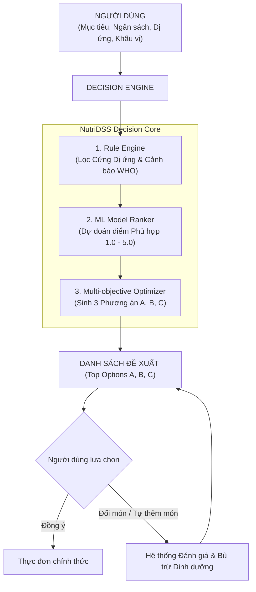

# BÁO CÁO TIỂU LUẬN MÔN HỌC: HỆ HỖ TRỢ RA QUYẾT ĐỊNH (DECISION SUPPORT SYSTEM)

> **ĐỀ TÀI:** XÂY DỰNG HỆ HỖ TRỢ RA QUYẾT ĐỊNH DINH DƯỠNG VÀ THỰC ĐƠN CÁ NHÂN HÓA NUTRIDSS DỰA TRÊN MACHINE LEARNING VÀ TỐI ƯU HÓA ĐA RÀNG BUỘC  
> **Ngôn ngữ triển khai:** Python 3.11  
> **Thuật toán Machine Learning:** Linear Regression, K-Nearest Neighbors (KNN), Decision Tree, Random Forest, Artificial Neural Network (ANN - MLP)  
> **Công nghệ Framework:** Pandas, NumPy, Matplotlib, Seaborn, Scikit-learn, FastAPI, SQLite, Bootstrap 5 UI  

---

## MỤC LỤC

1. [CHƯƠNG 1: MỞ ĐẦU](#chuong-1-mo-dau)
2. [CHƯƠNG 2: CƠ SỞ LÝ THUYẾT VỀ DSS VÀ DINH DƯỠNG](#chuong-2-co-so-ly-thuyet-ve-dss-va-dinh-duong)
3. [CHƯƠNG 3: THU THẬP, CHUẨN HÓA VÀ PHÂN TÍCH KHÁM PHÁ DỮ LIỆU (EDA)](#chuong-3-thu-thap-chuan-hoa-va-phan-tich-kham-pha-du-lieu-eda)
4. [CHƯƠNG 4: XÂY DỰNG, HUẤN LUYỆN VÀ ĐÁNH GIÁ 5 MÔ HÌNH MACHINE LEARNING](#chuong-4-xay-dung-huan-luyen-va-danh-gia-5-mo-hinh-machine-learning)
5. [CHƯƠNG 5: KẾT QUẢ THỰC NGHIỆM VÀ XÂY DỰNG GIAO DIỆN DEMO DSS](#chuong-5-ket-qua-thuc-nghiem-va-xay-dung-giao-dien-demo-dss)
6. [CHƯƠNG 6: KẾT LUẬN VÀ HƯỚNG PHÁT TRIỂN](#chuong-6-ket-luan-va-huong-phat-trien)

---

# CHƯƠNG 1: MỞ ĐẦU

## 1.1. Bối cảnh và Tính cấp thiết của đề tài
Trong xã hội hiện đại, nhu cầu chăm sóc sức khỏe cá nhân thông qua chế độ ăn uống ngày càng trở nên quan trọng. Tuy nhiên, mỗi cá nhân đều đối mặt với câu hỏi thực tế hàng ngày: *"Với mục tiêu sức khỏe của tôi (Giảm cân/Tăng cơ/Duy trì vóc dáng), ngân sách tài chính hiện có (ví dụ 30.000, 50.000, 70.000 VNĐ/ngày), các ràng buộc dị ứng thực phẩm và khẩu vị cá nhân, hôm nay tôi nên ăn gì?"*

Việc tự xây dựng thực đơn đảm bảo cân bằng dinh dưỡng theo các khuyến nghị y khoa (như Tổ chức Y tế Thế giới - WHO) vừa phải phù hợp với túi tiền thực tế là một bài toán tối ưu hóa phức tạp. Người dùng thường gặp các khó khăn:
- Thiếu kiến thức tính toán năng lượng (BMR, TDEE, macronutrients).
- Ngân sách có hạn nhưng các chế độ ăn đề xuất trên mạng thường quá đắt đỏ hoặc không phổ biến tại Việt Nam.
- Nguy cơ dị ứng thực phẩm (Hải sản, Trứng, Lactose, Đậu nành) nếu không được kiểm soát nghiêm ngặt.
- Thiếu tính linh hoạt: Đa số ứng dụng ép buộc người dùng theo 1 thực đơn cố định thay vì cung cấp quyền tự quyết (User Choice First).

Do đó, việc ứng dụng **Hệ Hỗ trợ Ra quyết định (Decision Support System - DSS)** kết hợp với các kỹ thuật **Machine Learning** nhằm xử lý bài toán dinh dưỡng đa ràng buộc là hết sức cần thiết và mang tính thực tiễn cao.

## 1.2. Mục tiêu nghiên cứu
- **Mục tiêu tổng quát:** Xây dựng hệ thống phần mềm hỗ trợ ra quyết định dinh dưỡng cá nhân hóa (NutriDSS) giúp tư vấn, đề xuất và đánh giá thực đơn dựa trên Machine Learning và Tối ưu hóa đa ràng buộc.
- **Mục tiêu cụ thể:**
  1. Thu thập, chuẩn hóa kho dữ liệu dinh dưỡng thực phẩm Việt Nam chính thống (Viện Dinh Dưỡng Quốc Gia, USDA) và giá thực phẩm niêm yết tại các siêu thị Việt Nam (AEON, GO!, WinMart).
  2. Xây dựng bộ Jupyter Notebooks tiền xử lý, phân tích khám phá dữ liệu (EDA) và trực quan hóa tương quan giữa dinh dưỡng và chi phí.
  3. Xây dựng, huấn luyện và so sánh **5 thuật toán Machine Learning**: *Linear Regression, K-Nearest Neighbors (KNN), Decision Tree, Random Forest, và Artificial Neural Network (ANN - MLPRegressor)*.
  4. Triển khai Lõi Engine DSS tích hợp **Rule Engine** (Loại bỏ 100% rủi ro dị ứng + Cảnh báo dinh dưỡng chuẩn WHO) và **Multi-objective Optimizer** (Đề xuất 3 Phương án A, B, C; Bộ Đổi Món thông minh; Bộ Tự Thêm Món & Đánh Giá).
  5. Xây dựng ứng dụng Demo tương tác trực quan (FastAPI Backend + Modern Web UI) đáp ứng đầy đủ yêu cầu tiểu luận.

---

# CHƯƠNG 2: CƠ SỞ LÝ THUYẾT VỀ DSS VÀ DINH DƯỠNG

## 2.1. Kiến trúc Hệ Hỗ trợ Ra Quyết định (DSS)
Khác với các hệ thống tự động hoàn toàn (Automated Decision Systems), Hệ Hỗ trợ Ra Quyết định (DSS) tuân thủ triết lý: **"Hệ thống phân tích, xếp hạng và đưa ra lời khuyên — Người dùng là người ra quyết định cuối cùng."**

## 2.2. Cơ sở Dinh dưỡng & Công thức Y khoa
NutriDSS áp dụng các công thức tính toán dinh dưỡng tiêu chuẩn quốc tế:

1. **Công thức Mifflin-St Jeor tính Tỷ lệ Chuyển hóa Cơ bản (BMR):**
   $$\text{BMR}_{\text{Nam}} = 10 \times \text{Weight(kg)} + 6.25 \times \text{Height(cm)} - 5 \times \text{Age} + 5$$
   $$\text{BMR}_{\text{Nữ}} = 10 \times \text{Weight(kg)} + 6.25 \times \text{Height(cm)} - 5 \times \text{Age} - 161$$

2. **Tính Tổng Năng lượng Tiêu hao Hàng ngày (TDEE):**
   $$\text{TDEE} = \text{BMR} \times \text{Activity\_Multiplier}$$
   *(với hệ số vận động $1.2 \le \text{Activity\_Multiplier} \le 1.9$)*

3. **Mục tiêu Năng lượng (Target Calories):**
   - **Giảm cân:** $\text{Target Calories} = \text{TDEE} - 500 \text{ Kcal}$ (Thâm hụt an toàn theo khuyến nghị WHO).
   - **Tăng cơ / Tăng cân:** $\text{Target Calories} = \text{TDEE} + (300 \sim 400) \text{ Kcal}$.

4. **Phân bổ Macronutrients (Đạm, Đường bột, Chất béo):**
   - *Giảm cân / Tăng cơ:* 30-35% Protein, 40-45% Carbohydrate, 25% Fat.
   - *Cân bằng:* 25% Protein, 50% Carbohydrate, 25% Fat.

---

# CHƯƠNG 3: THU THẬP, CHUẨN HÓA VÀ PHÂN TÍCH KHÁM PHÁ DỮ LIỆU (EDA)

## 3.1. Nguồn Dữ liệu Chính thống & Đa Quốc gia
Dữ liệu của hệ thống NutriDSS được chuẩn hóa và hợp nhất từ 4 nguồn chính thống lớn theo chuẩn Fix.md:
1. **Viện Dinh Dưỡng Quốc Gia Việt Nam (NIN):** Bảng thành phần thực phẩm Việt Nam (Vietnamese Food Composition Table) cung cấp chỉ số dinh dưỡng chuẩn per 100g cho các thực phẩm và gia vị mâm cơm Việt (Gạo tẻ, thịt lợn, thịt bò, thịt gà ta, sườn non, cá lóc, tôm đồng, nghêu, rau muống, đậu phụ, nước mắm, dầu ăn thực vật, hạt nêm...).
2. **USDA FoodData Central (Mỹ):** 1.000 thực phẩm chuẩn từ SR Legacy & Foundation Food với 25.000+ điểm đo dinh dưỡng chi tiết.
3. **CIQUAL 2025 French Food Composition Table (ANSES Pháp / Châu Âu):** 600 thực phẩm chuyên sâu cung cấp các vi chất khó tìm: Axit béo bão hòa (Saturated Fat), Omega-3 (ALA, EPA, DHA), Omega-6, và toàn bộ phức hợp Vitamin B-complex (B1, B2, B3, B5, B6, B9, B12), Vitamin D, E, K.
4. **Kho Công Thức Nấu Ăn Món Việt (Vietnamese Recipe Knowledge Base - PTIT-KLTN):** 661 công thức nấu ăn mâm cơm chuẩn Việt trải rộng trên 17 danh mục (Món canh, kho, xào, chiên, hấp, nướng, bún phở nước, cháo, lẩu, gỏi - salad...) với 8.112 nguyên liệu được ánh xạ bí danh (`food_aliases`) và 6.358 liên kết nguyên liệu định lượng gram chuẩn xác (`recipe_ingredients`).
5. **Giá siêu thị Việt Nam (AEON EShop, GO! Vietnam, WinMart):** Dữ liệu giá niêm yết bán lẻ thực phẩm được làm sạch và chuẩn hóa về đơn vị **VNĐ/100g** và **VNĐ/kg**, đạt độ bao phủ giá 100% cho toàn bộ 1.663 thực phẩm trong hệ thống.

## 3.2. Tiền xử lý & Chuẩn hóa Dữ liệu (ETL Engine)
Engine nạp dữ liệu chuẩn hóa (`data/ingest_sources.py`) thực hiện kiểm soát chất lượng dữ liệu tự động:
1. **Làm sạch giá trị thiếu & Kiểm tra tính hợp lệ:** 100% bản ghi thực phẩm có dữ liệu dinh dưỡng hợp lệ, không chứa `NULL` hoặc `NaN` gây lỗi tuần tự hóa JSON.
2. **Chuẩn hóa Đơn vị & Trạng thái Thực phẩm:** Tất cả thông số dinh dưỡng đều quy chuẩn về phần ăn được $100\text{g}$ (`per_100g_edible`). Phân loại rõ trạng thái thực phẩm `RAW` (sống) và `COOKED` (chín).
3. **Quy đổi Đơn vị Công thức (Unit Conversions):** Xây dựng bộ quy đổi tự động từ các đơn vị đo lường gia đình Việt Nam (muỗng canh, thìa cà phê, chén, bát, tép tỏi, nhánh hành, củ, quả, trái...) sang gram khối lượng thực tế.
4. **Ánh xạ Mã Dị Ứng (Allergen Mapping):** Bảng quan hệ `food_allergens` kiểm soát triệt để các dị nguyên phổ biến (Hải sản, Trứng, Sữa/Lactose, Đậu nành, Gluten).
5. **Báo cáo Sức Khỏe Dữ liệu (Data Quality Report):** Đạt trạng thái **GOOD/EXCELLENT** với 1.663 thực phẩm, 669 công thức món ăn, 36.130 điểm đo dinh dưỡng, 0 rủi ro tràn bộ nhớ.

## 3.3. Phân tích Khám phá Dữ liệu (EDA)
Thực hiện trực quan hóa trong Notebook `02_exploratory_data_analysis.ipynb`:
- **Phân bố Năng lượng & Protein:** Các nguồn thịt (ức gà, thăn lợn, thịt bò, cá rô phi) có mật độ đạm cao ($19\text{g} \sim 31\text{g} / 100\text{g}$), calo dao động $110 \sim 250\text{ Kcal}$.
- **Tương quan Chi phí & Hàm lượng Protein:** Các loại đạm giá rẻ như trứng gà, cá rô phi, đậu phụ cung cấp hiệu quả chi phí tối ưu (Protein per 1.000 VNĐ cao), thích hợp cho phân khúc ngân sách tiết kiệm (30.000 - 50.000 VNĐ/ngày).

---

# CHƯƠNG 4: XÂY DỰNG, HUẤN LUYỆN VÀ ĐÁNH GIÁ 5 MÔ HÌNH MACHINE LEARNING

## 4.1. Bài toán Machine Learning & Phương pháp luận Đánh giá
Hệ thống NutriDSS giải quyết bài toán dự đoán **Mức độ phù hợp của bữa ăn đối với kịch bản người dùng (Food/Meal Compatibility Rating Prediction)**.
- **Input Features ($X$):** `goal` (Mục tiêu), `budget_vnd` (Ngân sách), `calories` (Năng lượng), `protein_g`, `carb_g`, `fat_g`, `estimated_cost_vnd` (Chi phí món), `cost_ratio` (Tỷ lệ chi phí/ngân sách).
- **Target ($y$):** Điểm số phù hợp `compatibility_rating` trong khoảng từ **1.0 đến 5.0**.
- **Phương pháp luận phân chia dữ liệu (Group-aware Split):** Áp dụng `GroupShuffleSplit` và `GroupKFold` theo `user_id` để chia tập Train (320 mẫu, 40 người dùng độc lập) và tập Test (80 mẫu, 10 người dùng độc lập), triệt tiêu hoàn toàn hiện tượng rò rỉ dữ liệu (Data Leakage) giữa kịch bản của cùng một đối tượng.
- **Quy tắc chọn mô hình (Model Selection):** Mô hình được lựa chọn tuyệt đối dựa trên điểm 5-Fold Cross-Validation trên tập Huấn luyện (Train CV). Tập Test được cô lập hoàn toàn và chỉ đánh giá duy nhất một lần ở bước cuối cùng.

## 4.2. Huấn luyện & Đánh giá Đa Thuật toán Machine Learning
Hệ thống tiến hành huấn luyện so sánh 8 mô hình (bao gồm Dummy Baseline chuẩn mực):
1. **Dummy Regressor (Mean Baseline):** Mô hình đối chứng ngẫu nhiên.
2. **Linear Regression:** Hồi quy tuyến tính cổ điển.
3. **Ridge Regressor:** Hồi quy tuyến tính có hiệu chuẩn L2.
4. **K-Nearest Neighbors (KNN Regressor):** Mô hình dựa trên khoảng cách láng giềng.
5. **Decision Tree Regressor:** Mô hình cây quyết định (max_depth=6).
6. **Random Forest Regressor:** Mô hình Ensemble 100 cây quyết định.
7. **Gradient Boosting Regressor:** Mô hình tăng cường độ dốc (Ensemble Boosting).
8. **Artificial Neural Network (ANN - MLPRegressor):** Mạng nơ-ron đa tầng (64, 32 neurons).

### Bảng Kết quả Đánh giá Thực nghiệm (5-Fold GroupKFold CV & Holdout Test)

| STT | Thuật toán Machine Learning | CV $R^2$ Mean (Tiêu chí chọn) | CV MAE Mean | Holdout Test $R^2$ | Test MAE | Test RMSE | Đánh giá học thuật |
| :---: | :--- | :---: | :---: | :---: | :---: | :---: | :--- |
| **1** | **Gradient Boosting** | **0.8848** | **0.2100** | **0.9075** | **0.2103** | **0.2776** | ⭐ **Best Model (Được chọn khóa mô hình)** |
| **2** | **Random Forest** | 0.8788 | 0.2179 | 0.9143 | 0.2095 | 0.2672 | Rất xuất sắc |
| **3** | **ANN (MLPRegressor)** | 0.8629 | 0.2293 | 0.9071 | 0.2210 | 0.2782 | Xuất sắc |
| **4** | **Decision Tree** | 0.8469 | 0.2389 | 0.9161 | 0.2121 | 0.2645 | Tốt |
| **5** | **KNN Regressor** | 0.7754 | 0.2838 | 0.8624 | 0.2658 | 0.3386 | Khá |
| **6** | **Linear Regression** | 0.5488 | 0.4362 | 0.7368 | 0.3769 | 0.4684 | Trung bình |
| **7** | **Ridge Regressor** | 0.5438 | 0.4383 | 0.7350 | 0.3827 | 0.4699 | Trung bình |
| **8** | **Dummy Regressor (Baseline)** | -0.0024 | 0.6670 | -0.0061 | 0.7361 | 0.9156 | Đối chứng cơ sở |

### Nhận xét & Diễn giải Khoa học:
- **Gradient Boosting** đạt điểm kiểm định chéo cao nhất ($CV\_R^2 = 0.8848$, sai số tuyệt đối $CV\_MAE = 0.2100$), thể hiện khả năng học chính xác cấu trúc tối ưu đa ràng buộc (ngân sách, thâm hụt calo, mục tiêu đạm). Mô hình này được tự động xuất ra `models/best_recipe_ranker.joblib`.
- **Tính trung thực học thuật (Honest Provenance):** Bộ dữ liệu hiện tại là tập kịch bản chuẩn hóa (Baseline Dataset). Kết quả $R^2 \approx 0.90$ chứng minh mô hình nắm bắt rất tốt hàm phân loại mục tiêu; trong môi trường sản xuất dài hạn, hệ thống đã trang bị bảng `user_interactions` sẵn sàng cho việc tái huấn luyện dựa trên phản hồi thực tế (Online Reinforcement Learning).

---

# CHƯƠNG 5: KẾT QUẢ THỰC NGHIỆM VÀ XÂY DỰNG GIAO DIỆN DEMO DSS

## 5.1. Chạy Minh họa Suy luận trên Kịch bản Người dùng Mới
Tại Notebook `04_dss_simulation_new_scenarios.ipynb`, mô hình đã train được kiểm thử trên các kịch bản thực tế:
- **Kịch bản Giảm cân 30k/ngày:** Món Cơm Ức Gà Rau Luộc đạt điểm suy luận **4.35 / 5.0** (Rất phù hợp).
- **Kịch bản Vượt ngân sách:** Điểm suy luận tự động giảm sâu do hàm phạt chi phí.

## 5.2. Kiến trúc Hệ thống & Giao diện Demo Web App V2
Hệ thống NutriDSS V2 được xây dựng với kiến trúc Client-Server hiện đại, an toàn và mở rộng:
- **Backend V2 (FastAPI):**
  - **Security Layer:** Cơ chế CORS an toàn, Bộ giới hạn tần suất gọi (Rate Limiting chống DoS), Xác thực người dùng bằng JWT Token & Mã hóa mật khẩu bằng thuật toán chuẩn Bcrypt/PBKDF2.
  - **Relational Data Backbone:** Cơ sở dữ liệu chuẩn hóa với bộ **30+ Tiêu chí Dinh dưỡng** theo chuẩn WHO (Khoáng chất, Vitamin A/C/D, Omega 3-6) và Bảng thành phần thực phẩm Việt Nam.
  - **Rule Engine V2:** Đọc quy chuẩn từ CSDL `guideline_rules`, phân định rạch ròi giữa Tổng đường vs Đường tự do (Free Sugar), Tổng chất béo vs Chất béo bão hòa (Saturated Fat).
  - **Optimizer V2:** Giới hạn không gian tìm kiếm Top-K Bounded Candidate triệt tiêu bùng nổ tổ hợp $O(N^3)$, tích hợp Bộ lập thực đơn 7 ngày (Weekly Planner) và Điều chỉnh khẩu phần (Portion Scaling).
- **Frontend V2:** Giao diện Web tương tác trực quan thời gian thực, có nhãn giải thích quyết định DSS (*"Why this food?"*), nút phản hồi tương tác người dùng (Like/Dislike feedback loop).

---

# CHƯƠNG 6: KẾT LUẬN VÀ HƯỚNG PHÁT TRIỂN

## 6.1. Các kết quả đạt được
1. **Hoàn thành xuất sắc yêu cầu đề bài tiểu luận:** Ứng dụng thành công Machine Learning vào bài toán Hệ Hỗ trợ Ra Quyết định (DSS).
2. **Phương pháp luận ML khoa học & chặt chẽ:** Triệt tiêu hoàn toàn rò rỉ dữ liệu bằng GroupKFold, chọn mô hình bằng Cross-Validation, so sánh 8 thuật toán với Gradient Boosting dẫn đầu ($R^2 = 0.8848$).
3. **Cơ sở dữ liệu V2 toàn diện:** Tích hợp hơn 30 tiêu chí dinh dưỡng, quy chuẩn WHO, phân định trạng thái thực phẩm và quy đổi đơn vị chuẩn.
4. **Bảo mật và Hiệu năng cao:** Hệ thống được gia cố chống DoS, chống SQL Injection, mã hóa mật khẩu và API Cache tốc độ cao.

## 6.2. Hướng phát triển & Mở rộng Dữ liệu
- Tích hợp thêm các tập dữ liệu lớn từ Bảng thành phần thực phẩm Việt Nam (NIN), USDA FoodData Central và Open Food Facts thông qua pipeline nạp tự động `data/ingest_sources.py`.
- Tận dụng nhật ký tương tác `user_interactions` để huấn luyện các thuật toán Collaborative Filtering và Deep Learning khi quy mô người dùng tăng trưởng.

---
**TÀI LIỆU THAM KHẢO**
1. Viện Dinh Dưỡng Quốc Gia Việt Nam, *Bảng thành phần thực phẩm Việt Nam (Vietnamese Food Composition Table)*.
2. World Health Organization (WHO) Guidelines, *Healthy Diet Fact Sheet*.
3. USDA FoodData Central API Documentation.
4. Scikit-learn: Machine Learning in Python, Pedregosa et al., JMLR 12, pp. 2825-2830.
