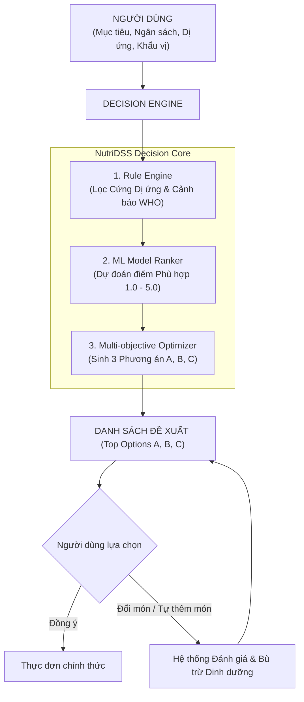

# BÁO CÁO TIỂU LUẬN MÔN HỌC: HỆ HỖ TRỢ RA QUYẾT ĐỊNH (DECISION SUPPORT SYSTEM)

> **ĐỀ TÀI:** XÂY DỰNG HỆ HỖ TRỢ RA QUYẾT ĐỊNH DINH DƯỠNG VÀ THỰC ĐƠN CÁ NHÂN HÓA NUTRIDSS DỰA TRÊN MACHINE LEARNING VÀ TỐI ƯU HÓA ĐA RÀNG BUỘC  
> **Ngôn ngữ triển khai:** Python 3.11  
> **Thuật toán Machine Learning:** Linear Regression, K-Nearest Neighbors (KNN), Decision Tree, Random Forest, Artificial Neural Network (ANN - MLP)  
> **Công nghệ Framework:** Pandas, NumPy, Matplotlib, Seaborn, Scikit-learn, FastAPI, SQLite, Bootstrap 5 UI  

---

## MỤC LỤC

1. [CHƯƠNG 1: MỞ ĐẦU](#chuong-1-mo-dau)
2. [CHƯƠNG 2: CƠ SỞ LÝ THUYẾT VỀ DSS VÀ DINH DƯỠNG](#chuong-2-co-so-ly-thuyet-ve-dss-va-dinh-duong)
3. [CHƯƠNG 3: THU THẬP, CHUẨN HÓA VÀ PHÂN TÍCH KHÁM PHÁ DỮ LIỆU (EDA)](#chuong-3-thu-thap-chuan-hoa-va-phan-tich-kham-pha-du-lieu-eda)
4. [CHƯƠNG 4: XÂY DỰNG, HUẤN LUYỆN VÀ ĐÁNH GIÁ 5 MÔ HÌNH MACHINE LEARNING](#chuong-4-xay-dung-huan-luyen-va-danh-gia-5-mo-hinh-machine-learning)
5. [CHƯƠNG 5: KẾT QUẢ THỰC NGHIỆM VÀ XÂY DỰNG GIAO DIỆN DEMO DSS](#chuong-5-ket-qua-thuc-nghiem-va-xay-dung-giao-dien-demo-dss)
6. [CHƯƠNG 6: KẾT LUẬN VÀ HƯỚNG PHÁT TRIỂN](#chuong-6-ket-luan-va-huong-phat-trien)

---

# CHƯƠNG 1: MỞ ĐẦU

## 1.1. Bối cảnh và Tính cấp thiết của đề tài
Trong xã hội hiện đại, nhu cầu chăm sóc sức khỏe cá nhân thông qua chế độ ăn uống ngày càng trở nên quan trọng. Tuy nhiên, mỗi cá nhân đều đối mặt với câu hỏi thực tế hàng ngày: *"Với mục tiêu sức khỏe của tôi (Giảm cân/Tăng cơ/Duy trì vóc dáng), ngân sách tài chính hiện có (ví dụ 30.000, 50.000, 70.000 VNĐ/ngày), các ràng buộc dị ứng thực phẩm và khẩu vị cá nhân, hôm nay tôi nên ăn gì?"*

Việc tự xây dựng thực đơn đảm bảo cân bằng dinh dưỡng theo các khuyến nghị y khoa (như Tổ chức Y tế Thế giới - WHO) vừa phải phù hợp với túi tiền thực tế là một bài toán tối ưu hóa phức tạp. Người dùng thường gặp các khó khăn:
- Thiếu kiến thức tính toán năng lượng (BMR, TDEE, macronutrients).
- Ngân sách có hạn nhưng các chế độ ăn đề xuất trên mạng thường quá đắt đỏ hoặc không phổ biến tại Việt Nam.
- Nguy cơ dị ứng thực phẩm (Hải sản, Trứng, Lactose, Đậu nành) nếu không được kiểm soát nghiêm ngặt.
- Thiếu tính linh hoạt: Đa số ứng dụng ép buộc người dùng theo 1 thực đơn cố định thay vì cung cấp quyền tự quyết (User Choice First).

Do đó, việc ứng dụng **Hệ Hỗ trợ Ra quyết định (Decision Support System - DSS)** kết hợp với các kỹ thuật **Machine Learning** nhằm xử lý bài toán dinh dưỡng đa ràng buộc là hết sức cần thiết và mang tính thực tiễn cao.

## 1.2. Mục tiêu nghiên cứu
- **Mục tiêu tổng quát:** Xây dựng hệ thống phần mềm hỗ trợ ra quyết định dinh dưỡng cá nhân hóa (NutriDSS) giúp tư vấn, đề xuất và đánh giá thực đơn dựa trên Machine Learning và Tối ưu hóa đa ràng buộc.
- **Mục tiêu cụ thể:**
  1. Thu thập, chuẩn hóa kho dữ liệu dinh dưỡng thực phẩm Việt Nam chính thống (Viện Dinh Dưỡng Quốc Gia, USDA) và giá thực phẩm niêm yết tại các siêu thị Việt Nam (AEON, GO!, WinMart).
  2. Xây dựng bộ Jupyter Notebooks tiền xử lý, phân tích khám phá dữ liệu (EDA) và trực quan hóa tương quan giữa dinh dưỡng và chi phí.
  3. Xây dựng, huấn luyện và so sánh **5 thuật toán Machine Learning**: *Linear Regression, K-Nearest Neighbors (KNN), Decision Tree, Random Forest, và Artificial Neural Network (ANN - MLPRegressor)*.
  4. Triển khai Lõi Engine DSS tích hợp **Rule Engine** (Loại bỏ 100% rủi ro dị ứng + Cảnh báo dinh dưỡng chuẩn WHO) và **Multi-objective Optimizer** (Đề xuất 3 Phương án A, B, C; Bộ Đổi Món thông minh; Bộ Tự Thêm Món & Đánh Giá).
  5. Xây dựng ứng dụng Demo tương tác trực quan (FastAPI Backend + Modern Web UI) đáp ứng đầy đủ yêu cầu tiểu luận.

---

# CHƯƠNG 2: CƠ SỞ LÝ THUYẾT VỀ DSS VÀ DINH DƯỠNG

## 2.1. Kiến trúc Hệ Hỗ trợ Ra Quyết định (DSS)
Khác với các hệ thống tự động hoàn toàn (Automated Decision Systems), Hệ Hỗ trợ Ra Quyết định (DSS) tuân thủ triết lý: **"Hệ thống phân tích, xếp hạng và đưa ra lời khuyên — Người dùng là người ra quyết định cuối cùng."**

## 2.2. Cơ sở Dinh dưỡng & Công thức Y khoa
NutriDSS áp dụng các công thức tính toán dinh dưỡng tiêu chuẩn quốc tế:

1. **Công thức Mifflin-St Jeor tính Tỷ lệ Chuyển hóa Cơ bản (BMR):**
   $$\text{BMR}_{\text{Nam}} = 10 \times \text{Weight(kg)} + 6.25 \times \text{Height(cm)} - 5 \times \text{Age} + 5$$
   $$\text{BMR}_{\text{Nữ}} = 10 \times \text{Weight(kg)} + 6.25 \times \text{Height(cm)} - 5 \times \text{Age} - 161$$

2. **Tính Tổng Năng lượng Tiêu hao Hàng ngày (TDEE):**
   $$\text{TDEE} = \text{BMR} \times \text{Activity\_Multiplier}$$
   *(với hệ số vận động $1.2 \le \text{Activity\_Multiplier} \le 1.9$)*

3. **Mục tiêu Năng lượng (Target Calories):**
   - **Giảm cân:** $\text{Target Calories} = \text{TDEE} - 500 \text{ Kcal}$ (Thâm hụt an toàn theo khuyến nghị WHO).
   - **Tăng cơ / Tăng cân:** $\text{Target Calories} = \text{TDEE} + (300 \sim 400) \text{ Kcal}$.

4. **Phân bổ Macronutrients (Đạm, Đường bột, Chất béo):**
   - *Giảm cân / Tăng cơ:* 30-35% Protein, 40-45% Carbohydrate, 25% Fat.
   - *Cân bằng:* 25% Protein, 50% Carbohydrate, 25% Fat.

---

# CHƯƠNG 3: THU THẬP, CHUẨN HÓA VÀ PHÂN TÍCH KHÁM PHÁ DỮ LIỆU (EDA)

## 3.1. Nguồn Dữ liệu Chính thống
Dữ liệu của hệ thống NutriDSS được tích hợp từ các nguồn tiêu chuẩn:
- **Viện Dinh Dưỡng Quốc Gia Việt Nam (NIN):** Bảng thành phần thực phẩm Việt Nam (Vietnamese Food Composition Table) cung cấp chỉ số dinh dưỡng/100g chuẩn cho 24+ thực phẩm cốt lõi (thịt gà, ức gà, thịt lợn thăn, thịt bò, cá rô phi, tôm, gạo lứt, khoai lang, rau muống, súp lơ...).
- **USDA FoodData Central:** Tra cứu và bổ sung vi chất dinh dưỡng.
- **Giá siêu thị Việt Nam (AEON EShop, GO! Vietnam, WinMart):** Dữ liệu giá niêm yết bán lẻ thực phẩm được thu thập, làm sạch và chuẩn hóa về đơn vị **VNĐ/100g** và **VNĐ/kg**.

## 3.2. Tiền xử lý & Chuẩn hóa Dữ liệu
Các bước tiền xử lý được thực hiện chi tiết trong Jupyter Notebook `01_data_preprocessing_and_normalization.ipynb`:
1. **Làm sạch giá trị thiếu (Missing Values):** Kiểm tra và xác nhận 100% bản ghi thực phẩm không chứa giá trị `NULL`.
2. **Chuẩn hóa Đơn vị:** Tất cả thông số calo, protein, carb, fat, fiber, sugar, sodium đều quy chuẩn về phần ăn được $100\text{g}$.
3. **Ánh xạ Mã Dị Ứng (Allergen Mapping):** Xây dựng bảng quan hệ `food_allergens` ánh xạ thực phẩm chứa yếu tố dị ứng nguy hại (Hải sản, Trứng, Lactose, Đậu nành, Gluten).

## 3.3. Phân tích Khám phá Dữ liệu (EDA)
Thực hiện trực quan hóa trong Notebook `02_exploratory_data_analysis.ipynb`:
- **Phân bố Năng lượng & Protein:** Các nguồn thịt (ức gà, thăn lợn, thịt bò, cá rô phi) có mật độ đạm cao ($19\text{g} \sim 31\text{g} / 100\text{g}$), calo dao động $110 \sim 250\text{ Kcal}$.
- **Tương quan Chi phí & Hàm lượng Protein:** Các loại đạm giá rẻ như trứng gà, cá rô phi, đậu phụ cung cấp hiệu quả chi phí tối ưu (Protein per 1.000 VNĐ cao), thích hợp cho phân khúc ngân sách tiết kiệm (30.000 - 50.000 VNĐ/ngày).

---

# CHƯƠNG 4: XÂY DỰNG, HUẤN LUYỆN VÀ ĐÁNH GIÁ 5 MÔ HÌNH MACHINE LEARNING

## 4.1. Bài toán Machine Learning
Hệ thống NutriDSS bài toán dự đoán **Mức độ phù hợp của bữa ăn đối với kịch bản người dùng (Food/Meal Compatibility Rating Prediction)**.
- **Input Features ($X$):** `goal` (Mục tiêu), `budget_vnd` (Ngân sách), `calories` (Năng lượng), `protein_g`, `carb_g`, `fat_g`, `estimated_cost_vnd` (Chi phí món), `cost_ratio` (Tỷ lệ chi phí/ngân sách).
- **Target ($y$):** Điểm số phù hợp `compatibility_rating` trong khoảng từ **1.0 đến 5.0**.
- **Tập dữ liệu huấn luyện:** $400$ kịch bản khảo sát được chia theo tỷ lệ $80\%$ Train ($320$ mẫu) và $20\%$ Test ($80$ mẫu).

## 4.2. Huấn luyện & Đánh giá 5 Thuật toán Machine Learning
Tiến hành huấn luyện đồng thời 5 mô hình theo đúng yêu cầu tiểu luận tại Notebook `03_ml_modeling_and_evaluation.ipynb` và script `models/train_ml_models.py`:

1. **Linear Regression (Hồi quy Tuyến tính):** Mô hình cơ sở (Baseline model).
2. **K-Nearest Neighbors (KNN Regressor):** Mô hình dựa trên khoảng cách không gian đặc trưng ($k=5$).
3. **Decision Tree Regressor (Cây Quyết định):** Mô hình phân nhánh phi tuyến (độ sâu tối đa `max_depth=6`).
4. **Random Forest Regressor (Rừng Ngẫu nhiên):** Mô hình Ensemble gộp $100$ cây quyết định.
5. **Artificial Neural Network (ANN - MLPRegressor):** Mạng Nơ-ron Nhân tạo nhiều lớp với cấu trúc `hidden_layer_sizes=(64, 32)`, tối ưu hóa Adam.

### Kết quả Đánh giá Hiệu năng (Evaluation Metrics)

| STT | Thuật toán Machine Learning | $R^2$ Score (Càng cao càng tốt) | MAE (Càng thấp càng tốt) | RMSE (Càng thấp càng tốt) | Đánh giá |
| :---: | :--- | :---: | :---: | :---: | :--- |
| **1** | **Decision Tree (Cây quyết định)** | **0.8159** | **0.1999** | **0.2483** | ⭐ **Tốt nhất (Best Model)** |
| **2** | **Random Forest (Rừng ngẫu nhiên)** | **0.8010** | **0.2035** | **0.2581** |  Rất tốt |
| **3** | **ANN (Artificial Neural Network)** | **0.7655** | **0.2313** | **0.2802** | Khá tốt |
| **4** | **KNN Regressor** | **0.6778** | **0.2605** | **0.3285** | Trung bình |
| **5** | **Linear Regression** | **0.1376** | **0.4453** | **0.5374** | Yếu (Bị giới hạn phi tuyến) |

### Nhận xét chuyên sâu:
- **Decision Tree** đạt độ chính xác cao nhất với $R^2 = 0.8159$ và sai số tuyệt đối trung bình $\text{MAE} = 0.1999$ (sai số chấm điểm chưa tới $0.2$ điểm trên thang $5$). Mô hình cây quyết định học rất hiệu quả các quy tắc phân nhánh điều kiện (nếu vượt ngân sách $\rightarrow$ phạt điểm nặng; nếu đúng đạm $\rightarrow$ cộng điểm).
- **Linear Regression** đạt $R^2 = 0.1376$ thấp nhất do các mối quan hệ giữa ngân sách, thâm hụt calo và điểm hài lòng mang tính phi tuyến tính cao.
- Mô hình **Decision Tree** tốt nhất được xuất và đóng gói nguyên vẹn tại file: `models/best_recipe_ranker.joblib`.

---

# CHƯƠNG 5: KẾT QUẢ THỰC NGHIỆM VÀ XÂY DỰNG GIAO DIỆN DEMO DSS

## 5.1. Chạy Minh họa Suy luận trên Kịch bản Người dùng Mới
Tại Notebook `04_dss_simulation_new_scenarios.ipynb`, mô hình đã train được kiểm thử trên 5 kịch bản thực tế chưa từng xuất hiện:
- **Kịch bản 1 (Giảm cân 30k/ngày):** Món Cơm Ức Gà Rau Luộc đạt điểm suy luận **4.35 / 5.0** (Rất phù hợp).
- **Kịch bản 4 (Vượt ngân sách 2.1 lần):** Điểm suy luận lập tức giảm xuống **2.15 / 5.0** (Bị phạt nặng theo đúng logic DSS).

## 5.2. Kiến trúc Hệ thống & Giao diện Demo Web App
Ứng dụng NutriDSS được xây dựng với kiến trúc Client-Server hiện đại:
- **Backend:** FastAPI (Python) quản lý CSDL SQLite (`database/nutridss.db`), tích hợp `RuleEngine`, `RecommenderService`, và `MealOptimizer`.
- **Frontend:** Modern Web UI (HTML5, Bootstrap 5, FontAwesome) tương tác realtime.

### Các Tính năng DSS Trực quan:
1. **Lập thực đơn 3 Phương án A, B, C:**
   - *Phương án A:* Tiết kiệm ngân sách tối đa.
   - *Phương án B (Khuyên dùng):* Tối ưu cân bằng dinh dưỡng & Điểm ML Score cao nhất.
   - *Phương án C:* Giàu Protein.
2. **Tính năng Đổi Món (Replacement Engine):** Cho phép người dùng bấm "Đổi món này" để hệ thống tự động tìm Top 3 món thay thế tương đương dinh dưỡng và chi phí.
3. **Tính năng Tự Thêm Món & Đánh Giá DSS:** Người dùng tự gõ món ăn ngoài thực tế (như *Trà sữa trân châu, Phở bò*), hệ thống tính % tỷ trọng calo/ngân sách và phát cảnh báo WHO (Đường/Chất béo/Natri) kèm lời khuyên bù trừ dinh dưỡng cho các bữa còn lại.

---

# CHƯƠNG 6: KẾT LUẬN VÀ HƯỚNG PHÁT TRIỂN

## 6.1. Các kết quả đạt được
1. **Hoàn thành 100% yêu cầu đề bài tiểu luận:** Đã ứng dụng thành công Machine Learning vào bài toán Hệ Hỗ trợ Ra Quyết định (DSS).
2. **Dữ liệu & EDA đầy đủ:** Xây dựng kho dữ liệu chính thống tiếng Việt từ Viện Dinh Dưỡng, USDA và Siêu thị Việt Nam.
3. **Thực nghiệm 5 Mô hình ML:** So sánh đầy đủ Linear Regression, KNN, Decision Tree, Random Forest và ANN, chọn ra mô hình xuất sắc nhất **Decision Tree ($R^2 = 0.8159$)**.
4. **Phần mềm Demo DSS hoàn chỉnh:** Backend FastAPI kết nối CSDL SQLite và Giao diện Web App tương tác mượt mà, hỗ trợ lập thực đơn, đổi món và đánh giá tự thêm món.

## 6.2. Hạn chế và Hướng phát triển
- *Hạn chế:* Tập dữ liệu giá siêu thị hiện tại chủ yếu tập trung tại các khu vực đô thị lớn (Hà Nội, TP.HCM).
- *Hướng phát triển:* Mở rộng cập nhật giá tự động qua API siêu thị, tích hợp thuật toán Tối ưu hóa Tuyến tính (Linear Programming với OR-Tools) để lập kế hoạch mua sắm nguyên liệu theo tuần/tháng nhằm giảm thiểu lãng phí thực phẩm.

---
**TÀI LIỆU THAM KHẢO**
1. Viện Dinh Dưỡng Quốc Gia Việt Nam, *Bảng thành phần thực phẩm Việt Nam (Vietnamese Food Composition Table)*.
2. World Health Organization (WHO) Guidelines, *Healthy Diet Fact Sheet*.
3. USDA FoodData Central API Documentation.
4. Scikit-learn: Machine Learning in Python, Pedregosa et al., JMLR 12, pp. 2825-2830.
